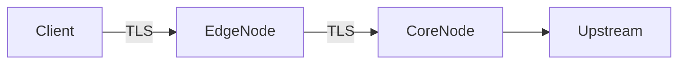

# ultra

**Репозиторий:** [github.com/NikitaDmitryuk/ultra](https://github.com/NikitaDmitryuk/ultra)

```bash
git clone https://github.com/NikitaDmitryuk/ultra.git
```

**ultra** — двухуровневый сетевой релей на Go: один процесс `ultra-relay` работает либо как **внешний узел** (`bridge` в конфиге), либо как **внутренний** (`exit`). Конфигурация задаётся JSON (`spec`), поддерживается горячая перезагрузка списка участников и локальный **loopback**-API для выдачи клиентских артефактов. Транспорт и параметры TLS между сегментами описаны в спецификации и передаются во встроенный движок пакетной обработки.

## Назначение

Проект рассчитан на сценарии, где трафик проходит **два последовательных сетевых узла** с согласованными TLS- и HTTP-параметрами между ними. Публичная документация описывает только механику развёртывания и конфигурации; детали протоколов на проводе определяются полями `spec.json`.

## Схема



В `spec.json` роли называются `bridge` и `exit`.

## Состав репозитория

- **`mimic`** — шаблоны HTTP-слоя для межузлового сегмента (host, path, заголовки). Сейчас доступен один встроенный шаблон `plusgaming`; описание полей — [docs/http-profiles.md](docs/http-profiles.md).
- **`auth`** — хранение идентификаторов в `users.json`, перечитывание файла, атомарная запись при изменениях через API.
- **`config`** — загрузка и проверка `spec`, генерация JSON для движка маршрутизации.
- **`proxy`** — запуск движка в процессе `ultra-relay`.
- **`adminapi`** — HTTP только на loopback: создание записей и выдача клиентских фрагментов.

## Зависимости

Сборка тянет модуль маршрутизации из экосистемы [Xray-core](https://github.com/XTLS/Xray-core) (лицензия и исходники — в `go.mod` / vendor graph).

## Сборка

```bash
make build                    # ./ultra-relay
make build-linux-amd64
make build-install            # ./ultra-install
make build-install-linux-amd64
make test
make format
make lint
```

Требуется Go из `go.mod`.

## Установка двух узлов

С машины с **Go**, **ssh**, **scp** и ключом к обоим хостам:

```bash
make install
```

Скрипт собирает бинарники и вызывает оркестратор. SSH: [docs/SSH.md](docs/SSH.md).

## Spec (`schema_version`)

В JSON задаётся `schema_version` (сейчас **1**). Поле `tunnel_tls_provision` фиксирует способ выдачи сертификата на узле `exit` для канала между узлами — [deploy/TLS.md](deploy/TLS.md).

## Локальная отладка (`dev_mode`)

1. TLS-материалы для `exit` (не коммитить):

   ```bash
   cd examples
   openssl req -x509 -newkey rsa:2048 -keyout test-key.pem -out test-cert.pem -days 3650 -nodes -subj "/CN=gw.cg.yandex.ru"
   ```

2. Пользователи: `users.json` по образцу `users.json.sample` или пустой массив `[]` и токен `ULTRA_RELAY_ADMIN_TOKEN` + `POST /v1/users`.

3. Терминал A — `exit`: `./ultra-relay -spec examples/spec.exit.dev.json`

4. Терминал B — `bridge`:

   ```bash
   export ULTRA_RELAY_ADMIN_TOKEN="$(openssl rand -hex 16)"
   ./ultra-relay -spec examples/spec.bridge.dev.json -admin-token "$ULTRA_RELAY_ADMIN_TOKEN"
   ```

5. Loopback API: `POST /v1/users`, `GET /v1/users/{uuid}/client` на `admin_listen`.

Согласуйте между процессами `mimic_preset`, `splithttp_path`, UUID туннеля и блок `splithttp_tls` (см. `deploy/spec.*.example.json`).

## Loopback API с административной машины

```bash
ssh -L 8443:127.0.0.1:8443 user@EDGE_HOST
curl -H "Authorization: Bearer …" http://127.0.0.1:8443/v1/users/...
```

Токен: `-admin-token` или `ULTRA_RELAY_ADMIN_TOKEN`. Без токена API не поднимается; при пустом `users.json` на `bridge` токен нужен, чтобы создать первую запись через API.

### Выдача конфигурации конечным узлам

## Деплой

```bash
make build-linux-amd64 build-install
./ultra-install -bridge FRONT_IP -exit BACK_IP -identity ~/.ssh/id_ed25519
```

Флаги: `./ultra-install -h` (`-public-host`, `-preset`, `-reality-dest`, `-reality-sni`, `-generate-exit-tls`, `-dry-run`, `-write-local`).

- [deploy/systemd/ultra-relay.service](deploy/systemd/ultra-relay.service)
- [deploy/bootstrap-bridge.sh](deploy/bootstrap-bridge.sh) / [deploy/bootstrap-exit.sh](deploy/bootstrap-exit.sh)

## Ограничения

- Поддерживается один идентификатор пресета в `mimic_preset` для текущей ветки релиза (см. справку установщика).
- Смена `splithttp_path` при пересборке может кратковременно разрывать существующие сессии между узлами.
- Поведение в разных сетевых средах не унифицировано; проверяйте конфигурацию на своих площадках.

## Лицензия

См. [LICENSE](LICENSE).
