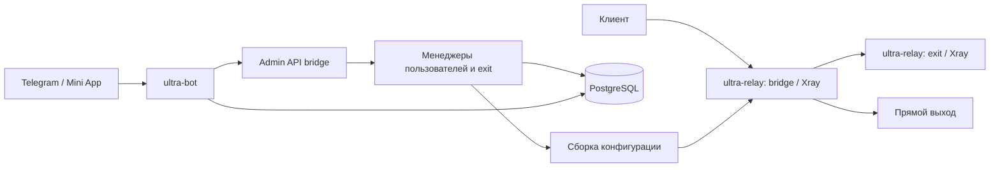

# Архитектура ultra

Это карта текущего устройства для выбора места изменения. Причины значимых новых
решений хранятся в [ADR](adr/README.md), процедуры — в [руководстве разработки](development.md).
Контракт для будущего создания региональных exit описан в [интеграции Vultr](vultr.md).
Сборка, параметры и эксплуатация описаны в [README](../README.md).
Границы транспортов и ограничения настроек — в [обходе цензуры](censorship-resistance.md).

## Компоненты и потоки

| Компонент | Ответственность | Основной источник |
| --- | --- | --- |
| `ultra-relay` | Роли bridge/exit, запуск встроенного Xray, управление состоянием bridge | [Точка входа](../cmd/ultra-relay/main.go) |
| `ultra-install` | Подготовка и применение установки по SSH | [План CLI](../cmd/ultra-install/plan_cli.go), [применение](../cmd/ultra-install/plan_apply.go) |
| `ultra-bot` | Telegram long polling, Mini App, администраторы и уведомления | [Точка входа](../cmd/ultra-bot/main.go), [бот](../internal/bot/bot.go) |

Клиентский трафик проходит через bridge; конфигурация Xray определяет прямой выход,
блокировку или передачу на exit. Управление пользовательским трафиком и обмен с Telegram
идут разными путями и не должны смешиваться при изменении маршрутизации.

Схема показывает основные отношения, а не все вызовы. API Mini App обращается к Admin API
для управления пользователями и exit, а состояние администраторов и уведомлений бот
получает через репозитории БД. См. [обработчики Mini App](../internal/bot/miniapp_api.go)
и [подключение зависимостей бота](../cmd/ultra-bot/main.go).

## Границы пакетов

- `internal/config` валидирует spec и строит JSON для Xray. Граница между моделью ultra
  и конфигурацией стороннего ядра проходит через `BuildBridgeXRayJSON` и `BuildExitXRayJSON`.
  См. [bridge builder](../internal/config/xray_bridge.go), [exit builder](../internal/config/xray_exit.go).
- `internal/proxy` владеет экземпляром Xray; lifecycle меняется через `Runner`.
  См. [runner](../internal/proxy/runner.go).
- `internal/auth` управляет пользователями и кешем через интерфейс `DBUserRepo`.
  Интерфейс объявлен здесь, чтобы не создавать цикл `auth → db → auth`.
  См. [DBManager](../internal/auth/dbmanager.go).
- `internal/db` реализует хранение, преобразования моделей и миграции; SQLC генерирует
  низкоуровневые запросы. См. [подключение БД](../internal/db/db.go) и [конфигурацию sqlc](../sqlc.yaml).
- `internal/exits` управляет списком и выбором exit по health/priority. См.
  [менеджер](../internal/exits/manager.go) и [селектор](../internal/exits/selector.go).
- `internal/installplan` валидирует и рендерит план; `cmd/ultra-install` организует применение,
  а `internal/install` выполняет SSH и системные операции. См.
  [рендер](../internal/installplan/render.go) и [SSH](../internal/install/ssh.go).

## Источники состояния и последствия изменений

JSON spec описывает конфигурацию узла; PostgreSQL хранит пользователей, exit-ноды,
трафик и состояние бота. Кеши менеджеров и выбор active exit — производное состояние.
Bootstrap exit-файл создаёт установщик, а правила его импорта и согласования с БД
реализованы в [ExitNodeRepo](../internal/db/repo_exit_nodes.go). При изменении установки
проверяй эти правила, а не считай bootstrap постоянно авторитетнее базы.

Изменения пользователей, exit и эффективного маршрута проходят через один сериализованный
путь применения. RTT и служебные поля health сами по себе не требуют reload.
`Runner.ReloadReason` сравнивает разобранные конфигурации и проверяет новую до остановки
старой; ошибка запуска вызывает попытку восстановления. Реальный reload всё ещё прерывает
соединения. Счётчик, время, причина и ошибка доступны в диагностике.
Источники: [применение](../cmd/ultra-relay/main.go), [Runner](../internal/proxy/runner.go),
[ADR failover](adr/0002-exit-failover.md).

Подписки хранятся как хеш токена на пользователя; публичный endpoint бота обращается
к Admin API. Старые VLESS-профили независимы от токена подписки. См.
[ADR подписки](adr/0003-happ-subscription.md) и [Happ](happ.md).
Для домашнего Linux есть [ultra-client](../cmd/ultra-client/main.go), для сравнительных
измерений — [ultra-bench](../cmd/ultra-bench/main.go).

## Границы доступа

Admin API предназначен для loopback и защищает API-запросы Bearer-токеном; статическая
страница `/admin` доступна отдельно от авторизации API. Адрес задаётся spec, поэтому
намерение использовать loopback нельзя считать доказательством фактической изоляции.
См. [authMiddleware](../internal/adminapi/server.go) и [настройки spec](../internal/config/spec.go).

Mini App проверяет Telegram initData и права администратора перед защищёнными действиями.
Это отдельная граница от Bearer-аутентификации Admin API: изменение одной не заменяет
проверку другой. См. [mustAdmin](../internal/bot/miniapp_api.go) и
[ValidateInitData](../internal/bot/auth.go).

Установщик выполняет внешние изменения по SSH. Результаты рендера могут содержать ключи,
токены и DSN; их нельзя добавлять в документацию как примеры фактической установки.
Канонические процедуры: [мобильная установка](../deploy/MOBILE_INSTALL.md),
[TLS](../deploy/TLS.md), [эксплуатация](../README.md).

## Кабинеты, облако и копии данных

[Закрытая регистрация](enrollment.md) разделяет VPN-пользователей и администраторов.
Бот проверяет Telegram, relay применяет изменения пользователей к ядру. Сохраняемый
номер изменения защищает подтверждение от конкурентной записи.
[Worker Vultr](vultr.md) работает на bridge; новые локации публикуются после проверки.
[Реплики PostgreSQL](replication.md) служат ручному восстановлению, запись остаётся на bridge.

## Дополнительный вход через RTC

[RTC](rtc.md) — опциональный модуль личного кабинета, выключенный по умолчанию.
Зашифрованные привязки хранятся в БД, приватные инструкции — вне репозитория.
Динамический gateway передаёт доверенную личность владельца в Xray без перезагрузки
при смене комнаты. Supervisor отдельно управляет транспортными процессами.
Входной трафик считается справочно и не увеличивает повторно квоты.
[ADR 0013](adr/0013-rtc-ingress.md) фиксирует границы хранения и исполнения.
